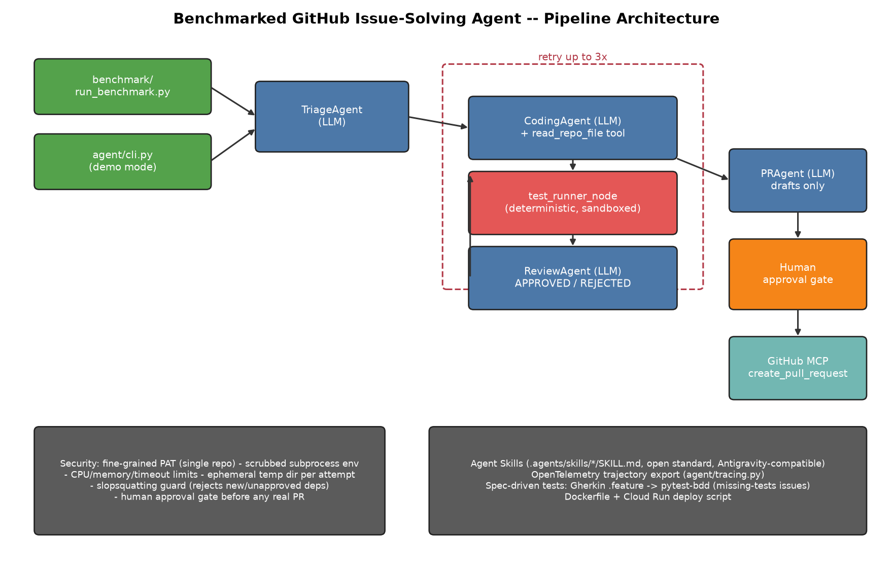

# Benchmarked GitHub Issue-Solving Agent

A multi-agent system (Google ADK + Gemini) that resolves narrowly-scoped
GitHub issues -- documentation/doctest fixes, lint errors, missing type
hints, outdated API usage, and missing tests -- against a seeded benchmark
repo, with a real evaluation harness comparing it to a single-shot LLM
baseline.

Built for Kaggle's "5-Day AI Agents Intensive" capstone.

## Why this, and why benchmarked

Most "AI fixes bugs" demos show one cherry-picked success. This project
instead: (1) scopes the problem to issue categories that are genuinely
tractable rather than general SWE-bench-style bug-fixing, (2) operates
against a small seeded sandbox repo the project controls rather than
spamming real open-source maintainers with unsolicited automated PRs, and
(3) reports actual resolution-rate numbers against a baseline, not just a
demo that may or may not work on camera.

## Architecture



Per issue, a coordinator (`agent/coordinator.py`) runs:

1. **TriageAgent** (LLM) -- classifies the issue and likely files involved.
2. A retry loop (up to 3 attempts) of:
   - **CodingAgent** (LLM, with a `read_repo_file` tool) -- writes a unified
     diff. Never guesses file content; always reads it first.
   - **test_runner_node** (plain deterministic code, not an LLM) -- applies
     the diff to a fresh ephemeral copy of the repo and runs the issue's
     oracle check (pytest/ruff/doctest, depending on category).
   - **ReviewAgent** (LLM) -- checks the patch actually addresses the issue
     and isn't just an accidental way to make the check pass.
3. **PRAgent** (LLM) -- drafts a PR title/body. Never opens anything itself.

`benchmark/run_benchmark.py` runs this over all 10 seeded issues with no
GitHub calls at all. `agent/cli.py` runs the same pipeline in "demo mode":
after resolution, a human is shown the patch/test result/review verdict
and must explicitly confirm before the GitHub MCP server's
`create_pull_request` tool is ever invoked.

### Why the current ADK API, not Sequential/LoopAgent

`google-adk` 2.x deprecates `SequentialAgent`/`LoopAgent`/`ParallelAgent` in
favor of a graph/dynamic-workflow model. For a retry-until-passing loop
like ours, ADK's own docs recommend the *dynamic workflow* pattern: a
plain async Python function, decorated with `@node`, that calls
`ctx.run_node(sub_agent, input)` imperatively. That's what
`agent/coordinator.py` does -- confirmed against the installed package
source and docs during development, not assumed from older tutorials.

## Course concepts demonstrated

| Concept | Where |
|---|---|
| Agent / multi-agent system (ADK) | `agent/coordinator.py`, `agent/sub_agents/` |
| MCP Server | `agent/tools/github_mcp.py` (official `github/github-mcp-server`, run from a downloaded binary via stdio) |
| Agent Skills | `.agents/skills/*/SKILL.md` -- real open-standard skills, readable by Antigravity and other tools supporting the Agent Skills standard |
| Security features | fine-grained PAT scoped to one repo; ephemeral sandboxed test execution with resource/timeout limits and a scrubbed environment; a "slopsquatting" guard that hard-rejects any patch introducing a new dependency; human-approval gate before any real PR |
| Deployability | `Dockerfile` + `scripts/deploy_cloud_run.sh` (documented; see caveat below) |
| Antigravity | used to build/orchestrate this project -- shown in the video, not in code |

Also present, from the course's later days: OpenTelemetry trajectory export
(`agent/tracing.py`), and spec-driven development for the "missing tests"
issue category -- a Gherkin `.feature` file is the acceptance spec, and the
CodingAgent's job is to implement `pytest-bdd` step definitions against it
(`sandbox_repo/features/`).

## Setup

```bash
python3 -m venv .venv && source .venv/bin/activate
pip install -r requirements.txt

cp .env.example .env
# edit .env: set GEMINI_API_KEY (aistudio.google.com/apikey)

python3 scripts/seed_sandbox_repo.py       # (re)generates the seeded benchmark repo
```

To use demo mode (`agent/cli.py`, real PR creation) you additionally need:

```bash
scripts/setup_github_mcp.sh                 # downloads the GitHub MCP server binary
# edit .env: set GITHUB_PERSONAL_ACCESS_TOKEN (fine-grained, scoped to one repo:
#   Issues: read/write, Pull requests: read/write) and SANDBOX_REPO=owner/repo
```

## Running it

```bash
# Fast local benchmark, no GitHub calls:
python3 benchmark/run_benchmark.py
python3 benchmark/baseline_single_shot.py
python3 benchmark/report.py                 # -> benchmark/results/report.md + comparison_chart.png

# Resolve one issue and (after human approval) open a real PR:
python3 -m agent.cli resolve --issue-id B1
```

See `benchmark/results/report.md` for the latest resolution-rate numbers
(multi-agent pipeline vs. single-shot baseline, same model, same
information).

## Security notes (honest, not hand-waved)

- Test execution is sandboxed via a fresh temp directory per attempt,
  `subprocess` timeout + CPU/address-space `resource` limits, and a
  scrubbed environment (no API keys/tokens reach the sandboxed process).
  It is **not** container/namespace-isolated -- this dev environment has
  no Docker -- so there's no real network isolation for whatever the
  sandboxed test process might do. The hardening path for production use
  is running the same subprocess inside a container (Docker/gVisor) with
  networking disabled.
- The "slopsquatting" guard is a hard rule, not a heuristic: any patch
  that edits `requirements.txt`/`pyproject.toml`/etc., or adds an `import`
  for a module not already used in the repo or in the standard library,
  is rejected before it's ever applied -- see
  `agent/tools/slopsquatting_guard.py`.
- The GitHub PAT should be fine-grained and scoped to exactly one
  repository, with only Issues and Pull Requests read/write permissions.
- No real PR is ever opened without an explicit human confirmation
  (`agent/cli.py`'s `y/N` prompt) -- the LLM drafts, it never sends.

## Deployability caveat

`Dockerfile` and `scripts/deploy_cloud_run.sh` are written and documented
but have not been built/deployed from this dev environment (no Docker
available here). They follow standard, low-risk patterns and are meant to
be exercised on a machine/CI environment that has Docker and, for Cloud
Run, an active GCP billing account.

## Repository layout

```
agent/
  coordinator.py        per-issue pipeline (dynamic ADK workflow)
  cli.py                 demo-mode entrypoint with human-approval gate
  tracing.py              OpenTelemetry span export
  sub_agents/             TriageAgent, CodingAgent, ReviewAgent, PRAgent, test_runner_node
  tools/                  sandbox_exec, patch_tools, slopsquatting_guard, github_mcp, repo_read, llm_backoff
sandbox_repo/             seeded "stringkit" Python package + the 10 benchmark issues
  issues.yaml              the curated issue set (id, description, oracle_cmd, ...)
  features/                Gherkin specs for the missing-tests issues
benchmark/
  run_benchmark.py         multi-agent pipeline over all issues
  baseline_single_shot.py  single raw Gemini call baseline, same info
  report.py                markdown + chart comparison
.agents/skills/            SKILL.md files (Antigravity-compatible, open Agent Skills standard)
scripts/                   seeding, GitHub MCP setup, architecture diagram, Cloud Run deploy
docs/architecture.png
```
